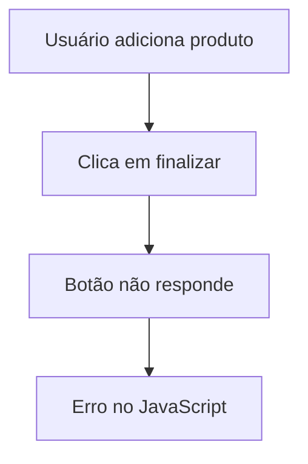

# Markdown-test

# :lady_beetle:  BUG REPORT TÉCNICO


# 📋 Informações Gerais

| Campo | Informação |
|---|---|
| Sistema | E-commerce Infantil |
| Ambiente | Produção |
| Navegador | Google Chrome 136 |
| Sistema Operacional | Windows 11 |
| Responsável | Luciana |
| Data | 21/05/2026 |

---

# :rotating_light: Descrição do Problema

> O botão de finalizar compra não responde ao clique após adicionar produtos ao carrinho.

---

# :arrows_counterclockwise: Passos para Reproduzir

1. Acessar a página inicial
2. Adicionar um produto ao carrinho
3. Ir até o carrinho
4. Clicar em **Finalizar Compra**

---

# :camera: Evidências

## Tela do erro
*Imagem gerada por IA


---

# :computer: Logs Técnicos

```javascript
buttonCheckout.addEventListener("click", () => {
   console.log("Botão clicado");
});
```

```bash
ERROR 500 - Internal Server Error
```

---

# :mag: Análise Técnica

<details>
<summary>Clique para expandir</summary>

Possível falha no carregamento do arquivo JavaScript responsável pelo checkout.

Arquivo suspeito:

```html
<script src="checkout.js"></script>
```

</details>

---

# :pushpin: Impacto

- [x] Usuário impedido de concluir compra
- [x] Afeta ambiente de produção
- [ ] Afeta banco de dados
- [ ] Falha de segurança

---

# :hammer_and_wrench: Possível Solução

```javascript
document.querySelector("#checkout")
```

Verificar:

- carregamento do script
- conflitos de DOM
- erros no console

  ---

  # :bar_chart: Fluxo do Problema



---

# :warning: Prioridade

| Severidade | Prioridade |
|---|---|
| Alta | Crítica |

---

# :woman_technologist: Responsáveis

- Front-end
- QA
- Suporte Técnico

 ---

 # :paperclip: Referências

- [Documentação Markdown](https://www.markdownguide.org/)
- [GitHub Docs](https://docs.github.com/)

---

# :white_check_mark: Status Atual

```diff
- BUG NÃO RESOLVIDO
```
